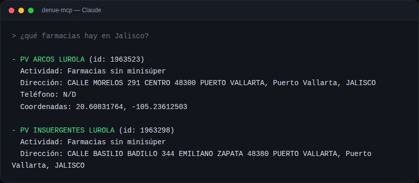

# denue-mcp

[](https://github.com/mxnueel/denue-mcp/actions/workflows/ci.yml)
[](LICENSE)
[](package.json)

An MCP (Model Context Protocol) server that gives Claude and other AI agents direct access to **INEGI's** open data: **DENUE** (the national directory of 5M+ businesses) and the **Banco de Indicadores** (official socioeconomic statistics — population, inflation, consumer confidence, industrial activity, and more), all across Mexico.



## Why

INEGI's data is some of the richest open data in Mexico, but using it means learning two separate REST APIs by hand, each with their own quirks (DENUE's search methods; the Indicadores API's undocumented split between its "BISE" and "BIE-BISE" data banks, which this server resolves automatically). This server exposes both as plain-language tools any MCP-compatible agent can call directly — *"find hardware stores within 1km of these coordinates in Guadalajara"*, *"what's Mexico's inflation rate this month"*, *"population of Jalisco"*.

Existing MCP integrations with DENUE (e.g. `cdmx-mcp`) bundle it as one of several Mexico City-only datasets. No MCP server previously existed for INEGI's Indicadores API. This one covers both, at national level — any of the 32 states, or the whole country at once.

## Tools

| Tool | What it does |
|---|---|
| `denue_buscar_cercania` | Search businesses by keyword near a lat/long coordinate (radius up to 5km) |
| `denue_buscar_por_estado` | Search businesses by keyword within a specific state, or nationwide |
| `denue_buscar_por_nombre` | Search businesses by commercial or legal name |
| `denue_detalle` | Get the full record for a specific establishment by its DENUE id |
| `inegi_indicador` | Get a socioeconomic indicator (population, inflation, consumer confidence, industrial activity, or any raw INEGI indicator code) nationally or by state, latest value or full history |

State names are accepted in plain Spanish ("Jalisco", "Ciudad de Mexico") — no need to know INEGI's numeric codes.

## Example

Asking Claude *"find pharmacies in Jalisco"* calls `denue_buscar_por_estado` and returns real DENUE records:

```
- PV ARCOS LUROLA (id: 1963523)
  Actividad: Farmacias sin minisúper
  Direccion: CALLE MORELOS 291 CENTRO 48300 PUERTO VALLARTA, Puerto Vallarta, JALISCO
  Telefono: N/D
  Coordenadas: 20.60831764, -105.23612503

- PV INSUERGENTES LUROLA (id: 1963298)
  Actividad: Farmacias sin minisúper
  Direccion: CALLE BASILIO BADILLO 344 EMILIANO ZAPATA 48380 PUERTO VALLARTA, Puerto Vallarta, JALISCO
  Telefono: N/D
  Coordenadas: 20.60264623, -105.23377801
```

Asking *"population of Jalisco"* calls `inegi_indicador` and returns the real INEGI figure:

```
Poblacion total (codigo 1002000001) — Jalisco:
- 2020: 8,348,151
```

## Setup

1. **Get a free DENUE API token** — register at [inegi.org.mx/servicios/api_denue.html](https://www.inegi.org.mx/servicios/api_denue.html).
2. Clone and build:
   ```bash
   git clone https://github.com/mxnueel/denue-mcp.git
   cd denue-mcp
   npm install
   npm run build
   ```
3. Register it with your MCP client.

   **Claude Code (CLI):**
   ```bash
   claude mcp add denue -s user -e INEGI_DENUE_TOKEN=your-token-here -- node /absolute/path/to/denue-mcp/build/index.js
   ```

   **Claude Desktop** (or any client using a `mcpServers` JSON config, e.g. `claude_desktop_config.json`):
   ```json
   {
     "mcpServers": {
       "denue": {
         "command": "node",
         "args": ["/absolute/path/to/denue-mcp/build/index.js"],
         "env": { "INEGI_DENUE_TOKEN": "your-token-here" }
       }
     }
   }
   ```

4. Ask your agent something like *"find pharmacies in Jalisco"* or *"what businesses are near 20.6597, -103.3496?"*

## Testing

```bash
npm test
```

Runs the full build and the test suite (`node --test`) — covers state-name resolution (`estados.ts`) and the missing-token error path for every DENUE call. CI runs this on every push against Node 18, 20, and 22.

## Contributing

Issues and PRs welcome — especially reports of DENUE response shapes this hasn't been tested against yet (different methods return slightly different field sets). Fork, branch, `npm test`, and open a PR.

## Status

All four tools have been tested end-to-end against the live DENUE API (MCP protocol handshake, tool listing, real invocations with results, and error handling with a missing/invalid token) and return real, correctly-parsed establishment data.

## License

MIT — see [LICENSE](LICENSE).
