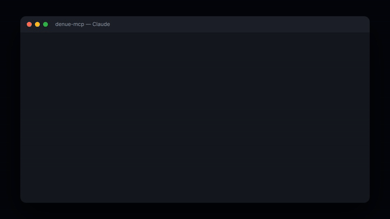

# denue-mcp

[](https://github.com/mxnueel/denue-mcp/actions/workflows/ci.yml)
[](LICENSE)
[](package.json)

MCP server for INEGI's **DENUE** (5M+ Mexican businesses) and **Banco de Indicadores** (population, inflation, consumer confidence, industrial activity) — query both in plain language from Claude or any MCP-compatible agent.

I built this because a client project needed to look up real Mexican business data from an agent, and INEGI only ships DENUE and Indicadores as two separate REST APIs — each with its own undocumented quirks. The one that actually bit me: Indicadores silently splits every code across two data banks, `BISE` and `BIE-BISE`, and asking the wrong one doesn't 404 — it returns `ErrorCode:100` with no hint which bank you should've used. `obtenerIndicador()` in [`src/indicadores.ts`](src/indicadores.ts) just tries one bank, and on `ErrorCode:100` retries with the other before giving up — so the agent never has to know banks exist.



*(Real query and response, replayed from the [`README example`](#example) below. Source in [`docs/demo-src`](docs/demo-src), rendered with [HyperFrames](https://github.com/heygen-com/hyperframes) — `cd docs/demo-src && npm run render`.)*

Existing MCP integrations with DENUE (e.g. `cdmx-mcp`) bundle it as one of several Mexico City-only datasets. No MCP server previously existed for INEGI's Indicadores API — this one covers both, at national level, across any of the 32 states or the whole country at once.

## Tools

| Tool | What it does |
|---|---|
| `denue_buscar_cercania` | Search businesses by keyword near a lat/long coordinate (radius up to 5km) |
| `denue_buscar_por_estado` | Search businesses by keyword within a specific state, or nationwide |
| `denue_buscar_por_nombre` | Search businesses by commercial or legal name |
| `denue_detalle` | Get the full record for a specific establishment by its DENUE id |
| `inegi_indicador` | Get a socioeconomic indicator (population, inflation, consumer confidence, industrial activity, or any raw INEGI indicator code) nationally or by state, latest value or full history |

State names are accepted in plain Spanish ("Jalisco", "Ciudad de Mexico") — no need to know INEGI's numeric codes.

## Example

Asking Claude *"find pharmacies in Jalisco"* calls `denue_buscar_por_estado` and returns real DENUE records:

```
- PV ARCOS LUROLA (id: 1963523)
  Actividad: Farmacias sin minisúper
  Direccion: CALLE MORELOS 291 CENTRO 48300 PUERTO VALLARTA, Puerto Vallarta, JALISCO
  Telefono: N/D
  Coordenadas: 20.60831764, -105.23612503

- PV INSUERGENTES LUROLA (id: 1963298)
  Actividad: Farmacias sin minisúper
  Direccion: CALLE BASILIO BADILLO 344 EMILIANO ZAPATA 48380 PUERTO VALLARTA, Puerto Vallarta, JALISCO
  Telefono: N/D
  Coordenadas: 20.60264623, -105.23377801
```

Asking *"population of Jalisco"* calls `inegi_indicador` and returns the real INEGI figure:

```
Poblacion total (codigo 1002000001) — Jalisco:
- 2020: 8,348,151
```

## Setup

1. **Get a free DENUE API token** — register at [inegi.org.mx/servicios/api_denue.html](https://www.inegi.org.mx/servicios/api_denue.html).
2. Clone and build:
   ```bash
   git clone https://github.com/mxnueel/denue-mcp.git
   cd denue-mcp
   npm install
   npm run build
   ```
3. Register it with your MCP client.

   **Claude Code (CLI):**
   ```bash
   claude mcp add denue -s user -e INEGI_DENUE_TOKEN=your-token-here -- node /absolute/path/to/denue-mcp/build/index.js
   ```

   **Claude Desktop** (or any client using a `mcpServers` JSON config, e.g. `claude_desktop_config.json`):
   ```json
   {
     "mcpServers": {
       "denue": {
         "command": "node",
         "args": ["/absolute/path/to/denue-mcp/build/index.js"],
         "env": { "INEGI_DENUE_TOKEN": "your-token-here" }
       }
     }
   }
   ```

4. Ask your agent something like *"find pharmacies in Jalisco"* or *"what businesses are near 20.6597, -103.3496?"*

## Testing

```bash
npm test
```

Runs the full build and the test suite (`node --test`) — covers state-name resolution (`estados.ts`) and the missing-token error path for every DENUE call. CI runs this on every push against Node 18, 20, and 22.

## Contributing

Issues and PRs welcome — especially reports of DENUE response shapes this hasn't been tested against yet (different methods return slightly different field sets). Fork, branch, `npm test`, and open a PR.

## License

MIT — see [LICENSE](LICENSE).
